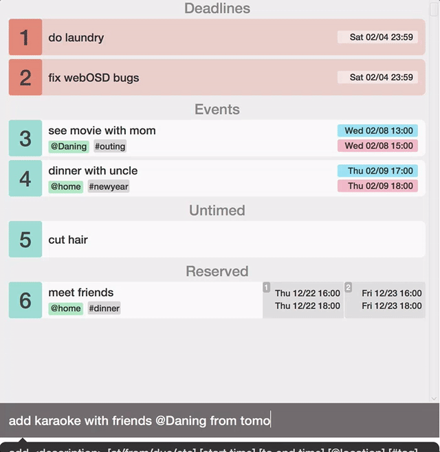

# J.Listee

CS2103 project of team t15-2

Get Things Done (GTD) software is a kind of utility applications that rests on the idea of moving planned tasks and projects out of the mind by recording them externally and then breaking them into actionable work items. This allows one to focus attention on taking action on tasks, instead of recalling them.

J.Listee is java-based desktop GTD software that can help users deal with tasks and make schedules, especially for folks who can type fast, spend most of the time near a computer, and prefer typing over mouse/voice commands.

Detailed requirement and description of the project is can be found at http://www.comp.nus.edu.sg/~cs2103/AY1516S2/ 

## Getting started
### Prerequisites

A recent version of the JVM is all that is required to run J.Listee. You can download JDK here http://www.oracle.com/technetwork/java/javase/downloads/index.html

All libraries are included within the J.Listee jar.

### Installation

Simply download the J.listee.jar file and double-click on it to run the application! 

### Quick Start
Try to type the following commands in the command box and see what’s happening!
```
add my first task @icube from today 4pm to 6pm (press enter)
update 1 updated first task (press enter)
done 1 (press enter)
```
### Need Help?
Need help?
Type “help” on the command box if you should require any assistance!
```
help
```
Detailed guidance can be found in the User Guide in [[T15-2j][V0.5].pdf](https://github.com/cs2103jan2016-t15-2j/main/blob/master/Deliverables/[T15-2j][V0.5].pdf).
## Example GIF of J.Listee

